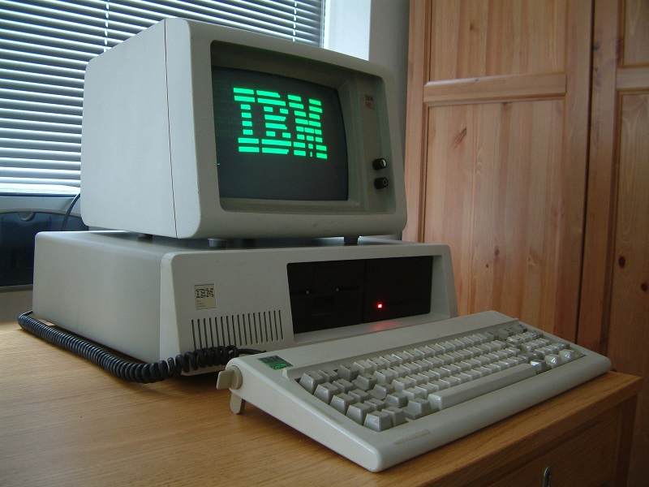
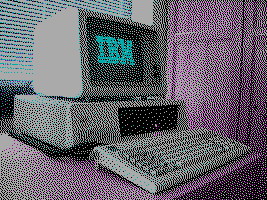
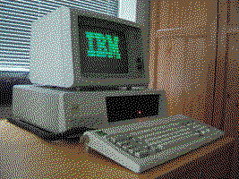
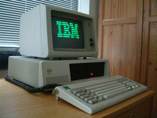

# CGAify

A little utility that takes an image and produces a reduced
version of it compatible with old CGA, EGA, and VGA 
graphics modes.

## Example

Original: 

As CGA 4-color: 

As EGA 16-color: 

As VGA 256-color: 

## Status

The supported modes are:

  * CGA 320x200 4-color
    * Palette 0 (Black, Red, Green, Yellow)
    * Palette 1 (Black, Magenta, Cyan, White)
  * EGA 320x200 16-color default palette
  * EGA 640x350 16-color default palette
  * VGA 320x200 256-color default palette

When reducing the size, the aspect ratio is preserved.

Note that this is just for fun/nostalgia, and not to make images
for viewing on actual old-school CGA screens... for that, I'd need 
to adjust for the aspect ratio of rectangular 80's pixels versus the 
square pixels of today.

## Installation

    go install github.com/rwtodd/Go.Cgaify/cmd/cgaify@latest

Giving `-h` will give usage information.

### Installation: step by step
- install go(lang) https://go.dev/doc/install
- install cgaify (`go install github.com/rwtodd/Go.Cgaify/cmd/cgaify@latest`)
- go to `$GOPATH/bin` where cgaify is installed (you can check `GOPATH` value by doing `go env`)
- run `./cgaify -h` to see options. `./cgaify -m CGA1 $PATH_TO_REPO/example/example.jpg`
- Image `example.jpg_CGA1.gif` will be generated in this directory
